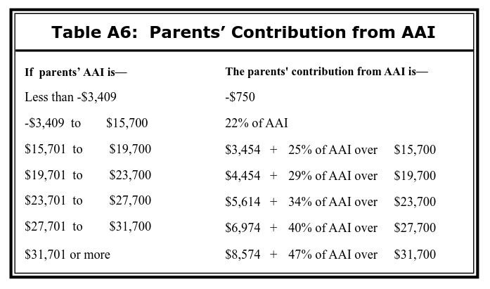
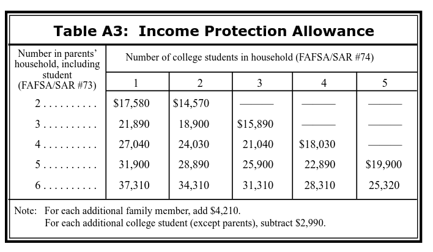

---
title: "Engineering Your FAFSA to Maximize Financial Aid"
date: 2015-05-26T23:14:27-04:00
draft: false
---

*It’s a beautiful summer day, your daughter just graduated high school, she’s all ready for college and you did your part too – you filed your FAFSA and you’re all excited and supportive about her going to college.  And then you get the letter in the mail. Your “Expected Family Contribution” is $30,000 and so she isn’t eligible for any financial aid. But how can you afford to spend $30,000 a year on college when you only make $80,000 and still have three other kids at home?*

***Disclaimer**: Any opinions in this post are solely my own and do not represent the views or policies of my employer. Consult with your accountant or attorney before implementing any of these strategies.*

*TL;DR: Need-based aid is based on the difference between the Cost of Attendance (COA) and the student’s Expected Family Contribution (EFC). Students can lower their portion of the EFC by lowering their assets and income and by having their parents lower their assets and income. This article details how the EFC is calculated and strategies for lowering it.*

# Understanding the FAFSA

The FAFSA (Free Application for Federal Student Aid) is a form to apply for federal and state student grants, work-study, and loans. Many schools require students to file a FAFSA to receive any need-based scholarships.

The calculation for the total aid available is straightforward:

*Financial Need = Cost of Attendance – Expected Family Contribution*

Your *Financial Need* is the maximum amount of need-based aid you’re eligible for.

The *Cost of Attendance* *(COA)* includes school tuition and fees, textbooks, supplies, housing, and transportation. For example, [NYU has an estimated COA of $70k](http://www.nyu.edu/content/dam/nyu/financialAid/documents/tuitiongeneral.pdf).

Your *Expected Family Contribution (EFC)* is an estimate of how much your family can afford to spend this year on college. This is based on the student’s and the parents assets and income.

The easiest way to lower your tuition bill is to send your kid to a cheaper school. But that isn’t always an option, and it’s possible that they’ll receive enough financial aid at the more expensive school to cover the difference in cost. Our goal in this article is to **increase** your *Financial Need* by **decreasing** your *EFC*.

# Calculating your Expected Family Contribution

So how is your EFC calculated? It depends on several details including whether the student is dependent on their parents, single or married, student income, student assets, parental income, parental assets, number of dependents, and number of college students in the household. For this discussion, we’re assuming that the student is single and is dependent on their parents.

**Student Assets and Income:**

The student’s contribution towards the EFC is the sum of 20% of the student’s *assets* and 50% of the student’s A*vailable Income*.

**Student Assets**

*Student assets* includes cash, savings and checking accounts (FAFSA/SAR #41), net worth of investments (FAFSA/SAR #42), and the net worth of businesses  (FAFSA/SAR #43)

**Student Income**

*Available Income* is the difference between the student’s *Income* and *Allowances.*

The student’s income includes his or her Adjusted Gross Income (FAFSA/SAR #36) and total untaxed income and benefits (Total of FAFSA/SAR#45a. through 45j.), which includes Traditional (tax-deductible) 401(k) and IRA contributions.

The *Allowances* include the student’s Federal income tax, State income tax allowance, Social Security Tax allowance, and a fixed *income protection allowance* of $6,310.

**Parental Assets and Income**

Parental assets and income are used to calculate their *Adjusted Available Income*, which is the sum of their *Available Income* and their *Contribution from Assets*. Between 22% and 47% of the *Parent’s Adjusted Available Income* is the *Parent’s Contribution.*

The *Parent’s Contribution* is a total for all of the children in the household. If there are four children in college, each child would only have 25% of the *Parent’s Contribution* included in their EFC.

**Parental Assets**

Similar to the student income, parental assets include cash, money in savings and checking accounts (FAFSA/SAR #90), net worth of investments  (FAFSA/SAR #91), and net worth of business (FAFSA/SAR #92).

However, unlike the student’s *Contribution from Assets* which is 20% of all of the student’s assets, parents first deduct a *Parent’s Education Savings and Asset Protection Allowance* to calculate their *Discretionary Net Worth*, and 12% of their *Discretionary Net Worth* is the parent’s *Contribution from Assets.*

**Parental Income**

Similar to the student income, *Parental Income* includes Adjusted Gross Income (FAFSA/SAR#85) and total untaxed income and benefits (Total of FAFSA/SAR #94a. through 94i.).

However, the Parental Allowances include Federal Tax, State Tax allowance (at a higher percentage than for students), Social Security Tax allowance, and an employment expense allowance (depending on the number of working parents), it also includes a variable *income protection allowance* which can significantly lower the parental contribution, depending on the household’s size.

# Minimizing your Expected Family Contribution

Now that we’ve reviewed how the EFC is calculated, let’s review some details:

- Student income and assets are taxed at higher rates than parental assets and income.
- All of the student and parent’s taxable and untaxable income is included in the student’s and parent’s *Available Income*.
- Unlike the income-based contribution, parental and student asset contributions are based on the date of filling.
- The *Parent’s Contribution* is a total for the household. *Parent’s Contribution* is a total for all of the children in the household. If there are four children in college, each one would only have 25% of that total.
- The family’s home and retirement accounts are not included in the student or parental assets.

So how can you use this knowledge to your advantage?

**Move Your Assets!**

1. Non-education IRAs, such as a Roth IRA, are not included in the student or parental assets. The benefit of specifically using a Roth IRA is that the contributions can be withdrawn at any time, with no penalty. This means that the student can literally put $5,500 in his or her Roth IRA ($5,500 is the max 2015), file the FAFSA, and withdraw all $5,500 a few weeks later, leaving them with the same money as before, but an EFC that’s $1100 lower. If each parent puts in $5,500, that would lower the parent’s contribution by an additional $1,320.
1. Student assets and income are included at a much higher percentage than parental assets and income. As such, it’s best to spend the student’s money before the parents.
1. All assets owned by the student or parents increases the EFC. If the parents or students give a large gift to a trusted friend or relative (say, a sibling who isn’t in college), that would significantly lower their assets and ultimately, their EFC.
1. In many instances, the parental contribution is a large part of the EFC. If delaying your studies would allow you to go to school at the same time as another sibling, you’d share the total parental contribution between the two of you. An even more aggressive strategy would be to have a sibling register for classes at a cheap community college, solely for the purpose of splitting the parental contribution between them.

**Optimize Your Efforts**

Because roughly 50% of the student’s post-tax pay is included towards the EFC, it may be more productive for the student to spend their first few years of college concentrating on the coursework and maintaining scholarships instead of working extra hours.

**Time Your Application**

1. If you’re considering purchasing a house, it is better to purchase it before filling the FAFSA, since the cash for the down payment is treated as an asset, but after the purchase, the equity in the home is not.
1. If the student or parents are expecting a large windfall, it’s best to submit the FAFSA beforehand. Likewise, if you’re expecting a large expense, it may be worth delaying and submitting the FAFSA afterwards.
1. The Federal deadline for FAFSA for 2015-16 students is June 30, 2016. However, each state and college could have earlier deadlines and *priority deadlines*, which have a higher likelihood of awarding need-based scholarships. Try to submit your FAFSA before the priority deadline, if there is one.

**Use 529s Intelligently**

529 plans owned by the parents and student are treated as assets. 529 plans owned by someone besides the student or parent are not included as an asset, but their distributions are included in the student’s untaxed income.

Therefore, the best strategy would be to for the student to first empty their own 529 plan, then for the parents to use theirs, and then to take the distributions from plans owned by other relatives when it won’t affect the student’s need-based aid for the following year (since 50% of student income is included in the student’s contribution), like in the student’s final year of schooling or after the student begins working and no longer qualifies for need-based aid.

# A practical example

So let’s work through the scenario in the opening paragraph, where Mr. and Mrs. Smith make a combined income of $80,000 a year and have to pay for Rebecca’s college tuition and living expenses for their other three children. Rebecca makes $20,000 a year and has also been saving for college.

- Student Assets: $10,000
- Student Income: $20,000
- Student Federal Tax: $2,000
- Student State Tax (NY: 6% of AGI): $1,200
- Parent Total Assets: $375,000
- Parent Total Income: $80,000
- Parental Federal Tax: $4,000
- Parental State Tax (NY: 8% of AGI): $6,400

**Contribution from Student Assets:**

- Student Assets: $10,000

Student’s contribution from assets: 20% \* $10,000 = **$2,000**

**Contribution from Student Income:**

- Student Total Income: $20,000
- Student Federal Tax: $2,000
- Student State Tax Allowance (NY: 6% of AGI): $1,200
- Social Security Tax Allowance (7.65% of AGI): $1,530
- Income Protection Allowance: $6,310

Total allowances are: $2,000 + $1,200 + $1,530 + $6,310 = $11,040

*Available Income*: $20,000 – $11,040 = $8,960

Student’s contribution from income: 50% \* $8,960 = **$4,480**

**Contribution from Parental Assets:**

- Parental Assets: $375,000
- *Education savings and asset protection allowance* (Mr. Smith is 45): $28,200

*Discretionary Net Worth*: $375,000 – $28,200 = $346,800

Parent’s contribution from assets: 12% \* $346,800 = $41,616

**Contribution from Parental Income:**

- Parental Total Income: $80,000
- Parental Federal Tax: $4,000
- Parental State Tax (NY: 8% of AGI): $6,400
- Social Security Tax Allowance (7.65% of AGI): $6,120
- *Income Protection Allowance* (6 people in household): $37,310
- *Employment Expense Allowance (Two working parents): $4,000*
- *Income Allowances*: $4,000 + $6,400 + $6,120 + $37,310 + $4,000 = $57,830
- *Available Income*: $80,000 – $57,830 = $22,170

**Total Parent Contribution:**

- Parent’s contribution from assets: 12% \* $346,800 = $41,616
- *Available Income*: $80,000 – $57,830 = $22,170

*Adjusted Available Income (AAI):*  $41,616 + $22,170 = $63,786

*Parents’ Contribution from AAI* is $8,574 + 47% of AAI over $31,700: $8,574 + 47% \* (63,786-$31,700) = **$23, 654**

*Parent’s Contribution: **$23, 654***

**Expected Family Contribution**

- Student’s contribution from assets: **$2,000**
- Student’s contribution from income: **$4,480**
- *Parent’s Contribution: **$23,654***

**EFC** = $2,000 + $4,480 + $23,654 = **$30,134**

**Analysis**

Without making any changes, the Smiths are looking at paying the full $30,000 for school tuition each year. But with some changes, it’s possible for them to become eligible for significant amounts of need-based aid.

If Rebecca moved $5k into a Roth IRA, paid for her textbooks and school supplies and equipment, she would lower her EFC by $1,000.

About 2/3 of the parent’s contribution is from their assets. If the Smiths were looking to purchase a $300k home, it would be worth waiting to file the FAFSA, as their EFC would decrease by $17k, allowing them significantly more need-based aid. Alternatively, they could move their assets into the names of their younger children, who are not yet going to college.

If Rebecca’s sister was going to start college next year, each of their parent contributions towards the EFC would be almost halved (the total EFC goes up slightly for each child in college), which could lower their EFC by almost $12k.

# Final Thoughts

The FAFSA form accounts for most assets and income. While it doesn’t appear to be possible to lower the parent or student income, the contribution from the assets can be easily changed, either by moving around money into another account, or simply timing your application around a large purchase or windfall.

# References

- FAFSA Form, 2015-16  <https://studentaid.ed.gov/sa/sites/default/files/2015-16-fafsa.pdf>
- THE EFC FORMULA, 2015–2016, <http://ifap.ed.gov/efcformulaguide/attachments/090214EFCFormulaGuide1516.pdf>
- Completing the FAFSA 2015–16, <https://studentaid.ed.gov/sa/sites/default/files/2015-16-completing-fafsa.pdf>
- How Aid is Calculated <https://studentaid.ed.gov/sa/fafsa/next-steps/how-calculated>
- How Do Grandparent-Owned 529 College Savings Plans Affect Financial Aid Eligibility? <http://www.fastweb.com/financial-aid/articles/how-do-grandparent-owned-529-college-savings-plans-affect-financial-aid-eligibility>
- How to Lower your EFC on the FAFSA and Get More Financial Aid <http://collegetuitionadvice.com/lower-the-efc-on-the-fafsa-youll-get-more-aid>

