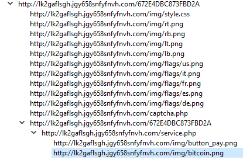

A common task in incident response is to work backwards from a web request to determine the actions that led to the web request being made. For example, when a user visits a malicious web page, did they reach it from a Google search? A phishing link? Or from somewhere else?

To aid in this analysis, I developed a new Wireshark feature called *HTTP Request Sequences*. *HTTP Request Sequences* uses HTTP's Referer and Location headers to graph a PCAP's HTTP requests as a tree. This enables analysts to easily see how one HTTP request leads to the next.

The *HTTP Request Sequences* feature is included in Wireshark 2.6, which will be released on April 18, 2018.

# HTTP Request Sequences Usage

The *HTTP Request Sequences* feature can be accessed by opening a PCAP file, clicking on the *Statistics* menu, and under *HTTP*, select *Request Sequences*, as depicted below:

For the [http_redirects.pcapng](https://wiki.wireshark.org/SampleCaptures?action=AttachFile&do=get&target=http_redirects.pcapng) capture file, this results in the following tree being displayed:

In the [http_redirects.pcapng](https://wiki.wireshark.org/SampleCaptures?action=AttachFile&do=get&target=http_redirects.pcapng) capture file, */counter* redirects to */counter?num=1*, then to *num=2*, through *num=11.* The request to */counter?num=1* contains a referer header with a value of */counter.* Tracing each of these requests previously required tedious examination of each web request. With the *HTTP Request Sequences* feature, the analysis can now be performed in seconds.

Now, for a more realistic example, courtesy of malware-traffic-analysis.net. For the [2015-08-31 - Traffic Analysis Exercise](https://www.malware-traffic-analysis.net/2015/08/31/), the scenario's goal is to "Examine the pcap to determine the exploit kit (EK), the payload, and the compromised website that kicked off this infection chain." Let's examine the PCAP with *HTTP Request Sequences* to see if we can find the compromised website.

Scrolling through the displayed sequences, you can see that the user visited vitaminsthatrock[.]com and from there, made requests to some strange-looking domains:

With a more detailed examination, it becomes clear that vclphjybj.ioxbpjgtqvwqfzmwhn[.]ga:13390 is hosting a Flash exploit. The requests afterwards also make it very clear to see the requests for ransomware-like URLs:

# Technical Challenges

## Lack of Referer Headers

One significant challenge is that not all web requests contain Referer headers. For example, the original page could use links with the [rel attribute](https://developer.mozilla.org/en-US/docs/Web/HTML/Link_types) or include a [Referrer-Policy HTTP header](https://developer.mozilla.org/en-US/docs/Web/HTTP/Headers/Referrer-Policy), both which allowing the originating page to control whether or not the client will include the Referer header.

Additionally, even without any special directives, the Referer header is omitted if a user navigates to an HTTP page from an HTTPS page to an HTTP page (see the default [no-referrer-when-downgrade](https://developer.mozilla.org/en-US/docs/Web/HTTP/Headers/Referrer-Policy#Directives) directive).

Obviously, if there is no Referer header present, it is unreasonable for Wireshark to make any assumption as to sequencing.

## Lack of Conclusive URI Sequencing

A browser can be forwarded to a single site from multiple sources. For example, a user may visit Example.com from both Google and Bing searches. If the user on Example.com then visits Foobar.com, it is impossible to determine if the request to Foobar.com is from the Google search or the Bing search, because the request to Foobar.com will only contain the Referer of Example.com. As such, the full sequence of requests can be either of the following:

1. Google -> Example.com -> Foobar.com, or
1. Bing -> Example.com -> Foobar.com

and there is no way to know which is correct. This means that any attempt at sequencing web requests into a tree is inherently a best-effort approach. The implementation of *HTTP Request Sequences* assumes that a Referer's URI refers to the most-recent time that URI was seen in either a request or referer header, as this is what is most likely to occur in practice. However, sequencing based on the most-recently seen URL can be potentially inaccurate.

A similar issue exists when attempting to sequence HTTP Location headers: because there is no identifier that connects a Location-based redirect to the following web request, it's impossible to determine if a web request is made because of a previous HTTP Location header or from another source (see [this Ask Wireshark](https://osqa-ask.wireshark.org/questions/27616/follow-http-redirects-automatically-http-status-codes-301302) discussion). To work around this issue, *HTTP Request Sequences* assumes that all HTTP Location Headers are followed by a web request to the Location header's value. While a client may not always follow the redirect, it is most likely that it will and so was considered to be a reasonable assumption.

## Resolving Relative Location Headers

HTTP Location headers can be in several forms, all of which are documented in [RFC 3986, Section 5.4](https://tools.ietf.org/html/rfc3986#section-5.4). Here are a few highlights:

- Any URI containing a colon (:) is an absolute URI and requires no further action. All other URIs are "relative".
- A URI that begins with an alphanumeric (A-Za-z0-9) is relative to the current URI. For example, an origin of `http://example.com/b/c/d;p?q` with a location of `g` will cause the client to request `http://example.com/b/c/g`
- A URI beginning with a slash (/) is relative to the originating host. For example, an origin of `http://example.com/b/c/d;p?q` with a location of `/g` will cause the client to request `http://example.com/g`.
- A URI beginning with a question mark (?) uses the current URI, but replaces (or adds) the current URI's query with the contents with the Location's value.

The above examples are all relatively simple to program, as they can be examined with a single conditional.

However, a location URI can also contain "." and ".." sequences, which traverse the URI's path in a similar method to traversing a directory. For example, an origin of `http://example.com/b/c/d;p?q` with a location of `../g` or `./../g` will cause the client to request `http://example.com/b/g`. The obvious choice is glib, which is already used heavily within Wireshark - and unfortunately has a [ten year old issue](https://bugzilla.gnome.org/show_bug.cgi?id=489862) for this exact feature!

Instead of attempting to implement the full URI resolution functionality (and likely introducing a security bug in the process), the current implementation of the code uses simple pattern-based parsing to resolve the most common URI patterns. Full URI resolution support is left for when URI resolution is implemented in glib or when a library like [uriparser](https://uriparser.github.io/) is added as a dependency.

# Thanks!

Thanks to Peter Wu and the Wireshark Dev team for their continued support during this development.

# Relevant patches

1. [Generate tree based on HTTP Referers](https://code.wireshark.org/review/#/c/25319/)
1. [Cleanup HTTP Referer tracking code](https://code.wireshark.org/review/#/c/25665/)
1. [Extend 'HTTP Referer statistics' to sequence HTTP redirects](https://code.wireshark.org/review/#/c/26679/)

