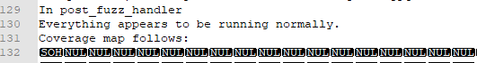
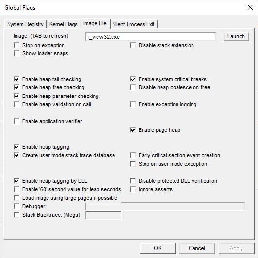
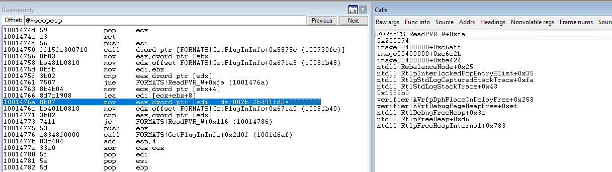
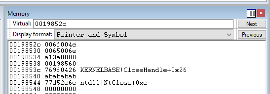

I’ve wanted to play with WinAFL since it was released. Here's how I used WinAFL to fuzz IrfanView v4.57 and find several bugs.

# Background

[Fuzzing](https://en.wikipedia.org/wiki/Fuzzing) is testing software for bugs by sending invalid, unexpected, or random data as inputs to a computer program. [WinAFL](https://github.com/googleprojectzero/winafl) is a fuzzer for Windows which can take a corpus of input files, track which code is executed, and generate new inputs to execute new execution paths.

Parsing complicated formats can be tough and the implementation is [likely to have bugs](https://trailofbits.github.io/ctf/vulnerabilities/source.html). I therefore decided to target IrfanView, a C-based image viewer which supports [many image formats](https://www.irfanview.com/main_formats.htm).

# Prep work:

Before fuzzing, I had to prepare my environment. Each of these steps could be its own post, so I'll give them in shorthand.

- **Disabling AV scanning** - Windows Defender (or any other AV) will otherwise scan programs at each execution and file access, consuming much of your CPU and greatly slowing down fuzzing.
- **Disabling automatic debugging** - I had previously enabled automatic debugging with Windbg. That might cause issues with some of the crash detection. For more info, see <https://docs.microsoft.com/en-us/windows-hardware/drivers/debugger/enabling-postmortem-debugging>
- **Building Dynamorio** - <https://dynamorio.org/page_building.html>
- **Building WinAFL** - <https://github.com/googleprojectzero/winafl>. Below are the commands I used in the Visual Studio Command Prompt. Note that you'll need to update the DynamoRIO path for your particular system:

```
git submodule update --init --recursive
mkdir build32
cd build32
cmake -G"Visual Studio 15 2017" -A Win32 .. -DDynamoRIO\_DIR="C:\Users\moshe\Desktop\fuzz\dynamorio\build\cmake" -DINTELPT=1 -DUSE\_COLOR=1
cmake --build . --config Release
```

- **Downloading IrfanView**: A zip file with the binary and base plugins is available here: <https://www.irfanview.com/download_sites.htm>
- **Prepare a corpus** - I started with the files from my ImageMagick fuzzing corpus (<https://github.com/moshekaplan/FuzzImageMagick>)

# Fuzzing IrfanView (inefficiently)

## Testing the setup with drrun:

Now that we have our environment ready, let’s make sure everything works:

```
C:\Users\moshe\Desktop\fuzz\dynamorio\build\bin32\drrun.exe -c "C:\Users\moshe\Desktop\fuzz\winafl\build32\bin\Release\winafl.dll" -debug -fuzz_iterations 10 -coverage_module "i_view32.exe" -target_module "i_view32.exe" -target_offset 0x082550 -- C:\Users\moshe\Desktop\fuzz\iview457\i_view32.exe "C:\Users\moshe\Desktop\fuzz\iview457\IMG.jpg" /convert="C:\Users\moshe\Desktop\fuzz\iview457\out.png" /silent
```

Here's a description of each argument:

- `-debug` : Generate a debug logfile, which we'll inspect to ensure coverage
- `-c` : DynamoRIO's "client", which will be winafl.dll
- `-fuzz_iterations 10` : Count of fuzz iterations before relaunching the target. In practice, this will only be executed once, so this is how many times the program will be tested.
- `-coverage_module "i_view32.exe"` : Module to record coverage for
- `-target_module "i_view32.exe"` : Module with fuzzing target
- `-target_offset* 0x082550`: Offset of the beginning of the fuzzed function. I used *wWinMain*, as was found with IDA Pro. As you can see below, the Image Base is 0x400000 and the function is located at 0x482550, so the `target_offset` is 0x482550 - 0x400000, or 0x082550.
- `-- C:\Users\moshe\Desktop\fuzz\iview457\i_view32.exe "C:\Users\moshe\Desktop\IMG.jpg" /convert="C:\Users\moshe\Desktop\out.png" /silent` : This is my command line argument to IrfanView. This command converts the input file "IMG.jpg" to "out.png". `/silent` is added to avoid displaying any pop-up notifications. Note that the input image (IMG.jpg) was manually copied in; it is not included with IrfanView.


If all goes well, IrfanView will launch and convert IMG.jpg to out.png. More importantly, we'll also see a log file generated in the working directory. On my system, it was named `afl.i_view32.exe.21708.0000.proc.log` and contained a coverage map:



I ran into a few issues during testing. In case you see any of the same issues, here are messages and the explanation for each:

- `Application ... Client library targets an incompatible API version and should be re-compiled` - This could be caused by using a 64-bit DynamoRIO build with a 32-bit winafl.dll. The first time I built DynamoRIO, I hadn't specifically used the x86 Native Tools Command Prompt for VS 2017, so DynamoRIO defaulted to a 64-bit build and I received this error.
- `WARNING: Target function was never called. Incorrect target_offset?` - This error is self-explanatory - it means that you have the wrong value for `target_offset`.
- `WARNING: Post-fuzz handler was never reached. Did the target function return normally?` - I experienced this error when pointing the `i_view32.exe`'s exported "entry" function because it ends by calling exit(), not RET.
- `ERROR: cannot find required file ".../lib32\debug\dynamorio.dll" Use -root to specify a proper DynamoRIO root directory.` - I experienced this error when putting the `-debug` parameter before the `-c` parameter.

## Minimizing the Corpus

As the AFL documentation describes: "If a large corpus of data is available for screening, you may want to use the afl-cmin utility to identify a subset of functionally distinct files that exercise different code paths in the target binary." WinAFL has similar functionality implemented in winafl-cmin.py:

```
python C:\Users\moshe\Desktop\fuzz\winafl\winafl-cmin.py --working-dir C:\Users\moshe\Desktop\fuzz\winafl\build32\bin\Release -w 3 -i C:\Users\moshe\Desktop\fuzz\samples -o C:\Users\moshe\Desktop\fuzz\irfanview\_cmin -t 4000 -D C:\Users\moshe\Desktop\fuzz\dynamorio\build\bin32 -covtype edge -target\_module "i\_view32.exe" -coverage\_module "i\_view32.exe" -target\_offset 0x082550 -- C:\Users\moshe\Desktop\fuzz\iview457\i\_view32.exe @@ /convert="NUL" /silent
```

The parameters for winafl-cmin.py are mostly similar to drrun, with a few exceptions:

- `--working-dir C:\Users\moshe\Desktop\fuzz\winafl\build32\bin\Release` : Directory containing winafl.dll.
- `-w 3`: Only use three workers. By default, winafl-cmin.py creates one worker per core (on my system, four), but that overloaded my computer and prevented normal usage, so I instead limit winafl-cmin.py to only three workers, leaving one core available for other tasks.
- `-i` : Directory with your sample input files
- `-o` : Directory where to store the minimized corpus
- `-t` : execution timeout, measured in milliseconds
- `-D`: DynamoRIO directory. This is the same location as where you executed drrun.exe before.
- `-covtype` : The default coverage tracker only tracks which basic blocks were traversed. Edge also tracks the order basic blocks were hit. So if your program goes from basic block A->B->C and A->C->B with two independent inputs, the basic block tracer would only see one interesting input, while the edge tracer would see both as interesting. (h/t to k0ss for the explanation)
- The command was modified: @@ will be replaced with a filename generated by WinAFL. The converted file's output location was set to "NUL" to minimize the writes to disk and improve performance. Note that if a program requires a specific filename (or extension), you can use "-f" to specify the filename that will replace @@.

winafl-cmin.py can take a while to run, so be patient.

## Fuzzing with WinAFL

Now that we have our minimized corpus, we're ready to begin fuzzing:

```
C:\Users\moshe\Desktop\fuzz\winafl\build32\bin\Release\afl-fuzz.exe -i C:\Users\moshe\Desktop\fuzz\irfanview_cmin -o C:\Users\moshe\Desktop\fuzz\winafl_output -t 1000+ -D C:\Users\moshe\Desktop\fuzz\dynamorio\build\bin32 -- -coverage\_module "i_view32.exe" -target_module "i_view32.exe" -target_offset 0x082550 -- C:\Users\moshe\Desktop\fuzz\iview457\i_view32.exe @@ /convert="NUL" /silent
```

Most of the arguments are similar to before. Notably, -i (input directory) is the winafl-cmin.py's output directory.

## Examining a crash

After fuzzing for about a week, I got my first crash - an out-of-bounds read in Formats.dll's ReadPVR\_W. Using Ghidra, you can see the C code for the crashing function:


Let's walk through this code in detail:

1. Line 25: A file (with the name stored in *param\_1*) is opened with [CreateFileW](https://docs.microsoft.com/en-us/windows/win32/api/fileapi/nf-fileapi-createfilew) and the handle is stored in a variable *hFile*.
1. Line 30: The file's size is retrieved by calling [GetFileSize](https://docs.microsoft.com/en-us/windows/win32/api/fileapi/nf-fileapi-getfilesize) and stored in a variable *\_Size*.
1. Line 35: *\_Size* bytes of memory are allocated and are referenced through a variable *lpBuffer*.
1. Line 37: The file's contents are read with [ReadFile](https://docs.microsoft.com/en-us/windows/win32/api/fileapi/nf-fileapi-readfile) into *lpBuffer*.
1. Line 47: *piVar10* is set to the sum of the address of *lpBuffer* and an offset read from lpBuffer.
1. Line 49: *piVar10* is dereferenced and compared to another value.

The issue is now clear: If the value read from *lpBuffer* (meaning, the file) is larger than the file's size, *piVar10* will contain an address outside of *lpBuffer* and so when *piVar10 is* dereferenced on line 49, the program will crash from an access violation.

## The Fix

I emailed Irfan Skiljan (the creator of IrfanView) the crashing input and he quickly sent a fix. Here's what the fixed code looks like in Ghidra:


As you can see, the offset read from the file is now validated to ensure that the offset is not negative and within the file.

# Fuzzing Smarter

Given the simplicity of this bug: Could we have fuzzed more intelligently and found it faster?

## Enabling GFlags

The first inefficiency is that we only looked for crashes. However, Windows [GFlags](https://docs.microsoft.com/en-us/windows-hardware/drivers/debugger/gflags) supports enabling additional heap verification to detect out-of-bounds heap reads and writes that normally would not otherwise cause an access violation.



GFlags creates corresponding registry entries in *Computer\HKEY\_LOCAL\_MACHINE\SOFTWARE\Microsoft\Windows NT\CurrentVersion\Image File Execution Options\i\_view32.exe*:


## Using a Targeted Offset

Each time the application launches, it's forced to execute the CLI parsing, load ini files, and more. Instead of doing that on each iteration, we can specify a more-targeted offset to specifically fuzz Formats.dll's ReadPVR\_W. First, let's replicate the crash again and review the call stack.



As you can see in the call stack, the call before *FORMATS!ReadPVR\_W+0xfa* is *image00400000 + 0xc6aff*, or address **0x04c6aff**. Looking at the function in IDA Pro, the function begins at **0x04c6aef**, so the offset is **0x0c6aef:**


Therefore, we can re-run drrun and afl-fuzz, but this time, set the `target_offset` to 0x0c6aef:

First test with drrun:

```
C:\Users\moshe\Desktop\fuzz\dynamorio\build\bin32\drrun.exe -c "C:\Users\moshe\Desktop\fuzz\winafl\build32\bin\Release\winafl.dll" -debug -fuzz_iterations 10 -coverage_module "i_view32.exe" -target_module "i_view32.exe" -target_offset 0x0c6aef -- C:\Users\moshe\Desktop\fuzz\iview457\i_view32.exe "C:\Users\moshe\Desktop\fuzz\iview457\IMG.jpg" /convert="C:\Users\moshe\Desktop\fuzz\iview457\out.png" /silent
```

Then fuzz with afl-fuzz:

```
C:\Users\moshe\Desktop\fuzz\winafl\build32\bin\Release\afl-fuzz.exe -f infile -i C:\Users\moshe\Desktop\fuzz\irfanview_cmin -o C:\Users\moshe\Desktop\fuzz\winafl_output -t 1000+ -D C:\Users\moshe\Desktop\fuzz\dynamorio\build\bin32 -- -coverage_module "i_view32.exe" -target_module "i_view32.exe" -target_offset 0x0c6aef -- C:\Users\moshe\Desktop\fuzz\iview457\i_view32.exe @@ /convert="NUL" /silent
```

Using a custom offset increased the performance from about 30 execs/second to about 800 execs/s. Much better!

Note that since the input filename is loaded into memory, we'll need to set it to a fixed value beforehand with -f. I also had some strange issues with this not actually triggering new paths. If anyone has any guidance as to why, please let me know.

## Using a Custom Harness

Instead of hardcoding the offset used to call `ReadPVR_W`, we can instead write a custom harness to load Formats.DLL and call `ReadPVR_W` directly. While it might require more reversing and writing some custom code, it has the benefit that even if Formats.DLL is recompiled and the code is rearranged, as long as `ReadPVR_W`'s signature remains the same, the harness will not need to be updated.

If we examine `ReadPVR_W` in Ghidra, we can see that it takes 3 parameters:


If we examine the crashing input in Windbg, the first parameter looks like UTF-16, from its alternating ASCII range values and then NULL bytes:



And if we change the display format to Unicode, we can see it’s the image file’s path:


The second parameter is a pointer to an empty string:


The third parameter is a Unicode string with the text “None”:


So we can write a simple harness to load in Formats.dll and call `ReadPVR_W`:

```C
#define _CRT_SECURE_NO_WARNINGS
#include <windows.h>
#include <stdio.h>


extern "C" __declspec(dllexport) void call_ReadPVR_W(wchar_t *fname);


typedef LPCWSTR* (WINAPIV *ReadPVR_W_t)(LPCWSTR, wchar_t*, wchar_t*);


HMODULE formats_dll_handle;
ReadPVR_W_t ReadPVR_W_handle;
wchar_t arg2[2048] = { 0 };
wchar_t arg3[2048] = { 0 };


__declspec(noinline) void call_ReadPVR_W(wchar_t *fname) {
	ReadPVR_W_handle(fname, arg2, arg3);
}

int wmain(int argc, wchar_t **argv)
{
	if (argc != 2) {
		printf("USAGE: %ws input-file\n", argv[0]);
		return 1;
	}

	formats_dll_handle = LoadLibraryA("FORMATS.DLL");
	if (formats_dll_handle == NULL) {
		printf("Failed to load FORMATS.DLL\n");
		return 1;
	}

	ReadPVR_W_handle = (ReadPVR_W_t)(GetProcAddress(formats_dll_handle, "ReadPVR_W"));
	if (ReadPVR_W_handle == NULL) {
		printf("Failed to get address for ReadPVR_W\n");
		return 1;
	}

	wcsncpy(arg3, L"None", 100);
	call_ReadPVR_W(argv[1]);
}
```


A few notes:

- `#define _CRT_SECURE_NO_WARNINGS` - is used so that we don't get a warning from using wcsncpy.
- `__declspec(noinline)` is used so that the function `call_ReadPVR_W` is not inlined. For more info, see https://docs.microsoft.com/en-us/cpp/cpp/noinline?view=msvc-160 . h/t to hardik for recommending this modifier.

Now we can repeat, first calling drrun:

```
C:\Users\moshe\Desktop\fuzz\dynamorio\build\bin32\drrun.exe -c C:\Users\moshe\Desktop\fuzz\winafl\build32\bin\Release\winafl.dll -debug -fuzz_iterations 10 -coverage_module "Fuzz_Formats_ReadPVR_W.exe" -coverage_module "FORMATS.DLL" -target_module "Fuzz_Formats_ReadPVR_W.exe" -target_method "call_ReadPVR_W" -nargs 1 -- C:\Users\moshe\Desktop\fuzz\Fuzz_Irfanview_Harness\Release\Fuzz_Formats_ReadPVR_W.exe "IMG.jpg"
```

and then calling afl-fuzz:

```
C:\Users\moshe\Desktop\fuzz\winafl\build32\bin\Release\afl-fuzz.exe -i C:\Users\moshe\Desktop\fuzz\Fuzz_Formats_ReadPVR_W_cmin -o C:\Users\moshe\Desktop\fuzz\Fuzz_Formats_ReadPVR_W_winafl_output -t 1000+ -D C:\Users\moshe\Desktop\fuzz\dynamorio\build\bin32 -- -coverage_module "Fuzz_Formats_ReadPVR_W.exe" -coverage_module "FORMATS.DLL" -target_module "Fuzz_Formats_ReadPVR_W.exe" -target_method "call_ReadPVR_W" -nargs 1 -- "C:\Users\moshe\Desktop\fuzz\Fuzz_Irfanview_Harness\Release\Fuzz_Formats_ReadPVR_W.exe" @@
```

This also runs at roughly 800 execs/s, as with the custom offset, but as mentioned, is much easier to develop and maintain than hardcoding function offsets.

## Improving the Corpus

Although executions per second is an important metric, it is not sufficient by itself. A corpus that exercises more of the code will greatly increase the chances of fuzzing finding a vulnerability. Besides existing corpora, bug trackers are an especially good source of interesting inputs, as inputs that were problematic for one program may also cause strange behavior in another. Here are some of the sources of files I added to my corpus:

- https://github.com/dvyukov/go-fuzz-corpus
- https://lcamtuf.coredump.cx/afl/demo/
- EOG's Bugzilla
- GIMP's Bugzilla
- GIMP's Gitlab
- gwenview's Bugzilla
- libsrvg's GitLab
- OpenCV's GitHub
- GraphicsMagick's launchpad
- and many more..

Once I had these files, I wrote a [simple Python script](https://github.com/moshekaplan/FuzzIrfanView/blob/main/prepare_sample_dir.py) to copy all the unique files into a single directory, so that they'd be ready for afl-cmin.

## Improving the Fuzzing Workflow

Now that I had a large corpus and the experience of writing a harness, I started thinking: How can I take this further?

I realized that I could go through each exported function from Formats.DLL and write a harness for each. As long as I used a consistent naming scheme for the harness executable and *target\_method*, I could write a script to call afl-cmin and afl-fuzz for each. So I [did that](https://github.com/moshekaplan/FuzzIrfanView/blob/main/generate_fuzz_commands.py), and found and reported more than ten bugs in IrfanView - with only having fuzzed a few of the more than 30 parsers.

The steps were straightforward, as was done before: Examine each exported function's signature in Ghidra, set breakpoints on the exported functions, examine the data, and test. As a neat trick, Windbg's scripting language can be used to put breakpoints on all of the exported functions at once:

```
.foreach ( place { !showexports formats} ) { bp place }
```

While many of the exported functions had the same signature as `ReadPVR_W`: A wide-char input filename, and two more buffers for output messages, a few had other signatures, like `Read_Utah_RLE`, which took only two arguments (an ASCII filename and output buffer), and `ReadTTF_W`, which took five arguments and Ghidra incorrectly decompiled.

## Patching Formats.dll's ReadMosaic_W:

One of Formats.dll's exported functions is `ReadMosaic_W`, for parsing *Mosaic* (.mos) image files. Reversing the function was straightforward - it only took two parameters. However, I quickly ran into an issue when attempting to fuzz it. As can be seen from the Ghidra output below, `ReadMosaic_W` unconditionally launches a dialog window to prompt the user for the input image's size:


Which in practice, looks like this:


Even if I could automate entering values into the dialog, there is significant overhead in creating and displaying it. The solution is simple: Patch the calls out!

Here's the original code of formats.dll v4.59.10.0, as seen in IDA Pro:


So I patched the basic block beginning with 100024B7, by removing the calls to `GetActiveWindow` and `DialogBoxParamW` and instead hardcoding a fixed value of 100 (0x64) as the image's width and height. I would have replaced the rest of the basic block's instructions with NOPs, but since IDA Pro complained that there was a relocation there, I ended the basic block early with an unconditional jump to 10002509:


After patching, I was able to fuzz Formats.dll's `ReadMosaic_W` without any further issues.

## Future Work

IrfanView supports many more file formats and capabilities that can be fuzzed. For example, IrfanView performs some parsing within i\_view32.exe itself and supports post-processing through Effects.DLL. Although the post-processing features are less commonly used than the file parsing code, they may also have vulnerabilities. The post-processing capabilities can be triggered in the CLI with an INI file generated through the Batch Convert interface:

```
i_view32.exe @@ /silent /advancedbatch /ini=C:\Users\moshe\Desktop\fuzz\iview459.1\adv_batch /convert="NUL"
```

## Final Thoughts

Fuzzing IrfanView was a fun project. Irfan Skiljan, the creator of IrfanView, was also extremely responsive, and usually fixed each of the [ten-plus bugs I reported](https://github.com/moshekaplan/Research/tree/main/IrfanView) within 48 hours. By far, the hardest parts of the project were [compiling 32-bit DynamoRIO](https://github.com/DynamoRIO/dynamorio/pull/4779) and getting the CLI arguments for drrun, [winafl-cmin](https://github.com/googleprojectzero/winafl/pull/301), and afl-fuzz correct.

The accompanying project repository for this post is available here: <https://github.com/moshekaplan/FuzzIrfanView>

## References

- <https://ezqelusia.blogspot.com/2020/05/start-fuzzing-fuzz-various-image-viewers.html>
- <https://github.com/googleprojectzero/winafl>
- <https://x9security.com/installing-winafl/>
- <https://sigpwn.io/blog/2018/1/29/using-winafl-to-fuzz-hangul-appshield>
- <https://h0mbre.github.io/Fuzzing-Like-A-Caveman/>
- <https://www.fuzzingbook.org/>
- <https://reverseengineering.stackexchange.com/questions/18361/windbg-setting-a-breakpoint-on-every-exported-function-of-a-module>
- <https://www.irfanview.com/main_formats.htm>
- <https://www.irfanview.com/plugins.htm>

