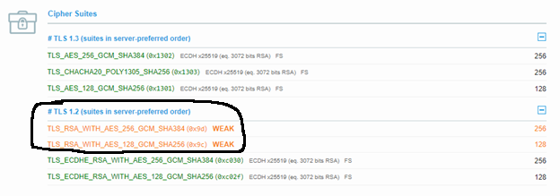

I recently received an email that I needed to schedule an appointment on a website. However, when I attempted to visit the page, Chrome displayed a nasty error message:

I had never encountered an `ERR_HTTP2_INADEQUATE_TRANSPORT_SECURITY` error before and since googling it resulted in all pages that didn’t explain the issue, my next step was obvious: Analyze the traffic with Wireshark!

# Analyzing the TCP session in Wireshark

To prepare for the analysis, I [configured my browser to store TLS secrets and Wireshark to read them](https://wiki.wireshark.org/TLS#using-the-pre-master-secret), so I’d be able to view the plaintext traffic. I then looked up the server’s IP addresses and filtered my display with Wireshark’s [ip.addr](https://www.wireshark.org/docs/dfref/i/ip.html#ip.addr) and [ipv6.addr](https://www.wireshark.org/docs/dfref/i/ipv6.html#ipv6.addr) fields to only include traffic to or from the web server, which resulted in the following short capture:

Reading through the packets:

1) Client launches Chrome and establishes a TCP session on port 443 to the web server (packets 1-3)

2) Client initiates a TLS v1\.2 connection with a Client Hello and receives a Server Hello, Certificate, and Server Hello Done (packets 4-10)

3) Client sends the Key Exchange, Change Cipher Spec, and "Finished" messages, the server responds with Change Cipher Spec and Finished\. The TLS handshake is now complete\. (packets 11-12)

4) Inside the TLS session, the server leaps straight into an HTTP2 session by sending SETTINGS and WINDOW\_UPDATE frames\. This is because the client and server both support [ALPN](https://en.wikipedia.org/wiki/Application-Layer_Protocol_Negotiation) (as is visible in Wireshark field [tls.handshake.extensions_alpn_str](https://www.wireshark.org/docs/dfref/t/tls.html#tls.handshake.extensions_alpn_str)), and the SERVER HELLO (packet 6) had an ALPN extension for HTTP2\. (packets 13-14)

ALPN Next Protocol value of "h2" indicates an upcoming HTTP/2 connection

5) The client then shuts down the HTTP/2 session by sending an HTTP/2 GOAWAY frame and closes the TCP session (packets 15-19)\.

This seemed like very strange behavior: The TCP session, TLS session, and even the HTTP/2 sessions were all successfully created and operational – and then the client sent a GOAWAY, frame indicating that it *chose* to terminate the connection.

Also interestingly, this failure only manifested when accessing the website from Chrome and Edge, but not when downloading it with curl -k, indicating that the issue was likely related to some part of the TLS connection. But it was unclear what the issue was.

# RFC 9113

Further web searches took me to RFC 9113, the RFC for HTTP/2. [RFC 9113 Section 9.2.2, TLS 1.2 Cipher Suites](https://httpwg.org/specs/rfc9113.html#tls12ciphers) states:

> A deployment of HTTP/2 over TLS 1.2 SHOULD NOT use any of the prohibited cipher suites listed in [Appendix A](https://httpwg.org/specs/rfc9113.html#BadCipherSuites).
> 
> Endpoints MAY choose to generate a connection error ([Section 5.4.1](https://httpwg.org/specs/rfc9113.html#ConnectionErrorHandler)) of type [INADEQUATE_SECURITY](https://httpwg.org/specs/rfc9113.html#INADEQUATE_SECURITY) if one of the prohibited cipher suites is negotiated. A deployment that chooses to use a prohibited cipher suite risks triggering a connection error unless the set of potential peers is known to accept that cipher suite.

Now this looks promising. HTTP/2’s RFC is stating that if a connection is made with one of the “Bad Ciphers” listed in RFC 9113’s Appendix A, it “risks triggering a connection error”. Looking at the packet capture, the cipher suite specified in the SERVER HELLO (tls.handshake.type == 2 && tls.handshake.ciphersuite) was `TLS_RSA_WITH_AES_256_GCM_SHA384`, which was one of the bad ciphers. But why would the server choose to use that bad cipher suite?

# Reviewing the server's configuration with SSLLabs

To determine why the server chose `TLS_RSA_WITH_AES_256_GCM_SHA384`, I decided to examine the server’s SSL configuration. [SSL Labs provides a nifty website](https://www.ssllabs.com/ssltest/) that can scan a provided web server and display a report of the supported TLS protocols and cipher suites.

What’s noteworthy in the SSLLabs output is that the server’s first two TLS 1.2 entries listed are `TLS_RSA_WITH_AES_256_GCM_SHA384` and `TLS_RSA_WITH_AES_128_GCM_SHA256` - which are both included within the list of bad ciphers in RFC 9113’s Appendix A!

# TLS versions

We now understand why I was receiving the `ERR_HTTP2_INADEQUATE_TRANSPORT_SECURITY` error - because the TLS session was being established with an insecure protocol that HTTP/2 disallowed. But why then does the issue only manifest on this second computer? Why can I access the site on my home computer without issue?

I realized the key detail was in the supported TLS protocols. My home computer was connecting to the website with TLS 1.3, which supports other cipher suites. But the second computer was running through an SSL inspection solution that mandated TLS 1.2, which preferred the weak cipher suites. That’s also likely the reason why the system owner hadn’t fixed the issue – most users probably connect over TLS 1.3 and so the TLS 1.2 misconfiguration wasn’t causing problems for them.

To test this hypothesis, I launched Edge with `--ssl-version-max=tls1.2`, which disabled TLS 1.3. As predicted, using TLS 1.2 forced the use of the insecure cipher suites and triggered an `ERR_HTTP2_INADEQUATE_TRANSPORT_SECURITY` error.

As a final confirmation that the error was caused by HTTP2, I ran a second test to launch Edge with both TLS 1.3 and HTTP/2 disabled. (Edge can have HTTP/2 disabled by launching it with `--disable-http2`). In this second test, the web request used HTTP/1.1 over TLS 1.2 without any errors.

***Note**: The command-line arguments will only take effect if you close all msedge.exe processes before launching the new Edge process. I highly recommend closing them via Process Explorer. When I was testing, Edge kept plenty of processes running, even after all browser windows were closed.*

As part of writing this blog post, I was reading RFC 9113 and found something even more shocking - this exact scenario of a web server supporting the weaker cipher suites causing HTTP/2 connections to fail is explicitly stated in RFC 9113, section 9.2.2!

> Note that clients might advertise support of cipher suites that are prohibited in order to allow for connection to servers that do not support HTTP/2. This allows servers to select HTTP/1.1 with a cipher suite that is prohibited in HTTP/2. However, this can result in HTTP/2 being negotiated with a prohibited cipher suite if the application protocol and cipher suite are independently selected.

# Conclusion

At this point, we have a clear understanding of what is happening. The second computer can't access the website because the client connects with TLS 1.2, the server is configured to prefer "bad" cipher suites for TLS 1.2, and the client and server are trying to complete the web request over HTTP/2, which doesn't allow the "bad" cipher suites. So how would we fix access for someone who wouldn’t be able to run their browser with additional command-line arguments?

Obviously, the best solution would be for the website owner to reconfigure the website’s supported TLS 1.2 cipher suites, but that’s outside of our control. However, the entire issue is caused by the SSL inspection solution mandating TLS 1.2 and the web server's preferred TLS 1.2 cipher suites being "bad". By modifying the SSL inspection solution to allow TLS 1.3 connections to the web server, it would be possible to securely connect over TLS 1.3 and avoid the TLS 1.2 misconfiguration. If the TLS 1.3 configuration would have also preferred "bad" cipher suites, another option would have been to configure the ssl inspection solution to strip the ALPN header and prevent upgrading the connection to HTTP/2. Then, because the connection would have been limited to HTTP/1.1, the browser would not terminate the TLS 1.2 connections because of the insecure cipher suite being used.

Thanks for reading along, I hope you enjoyed going down this rabbit hole as much as I did. 

