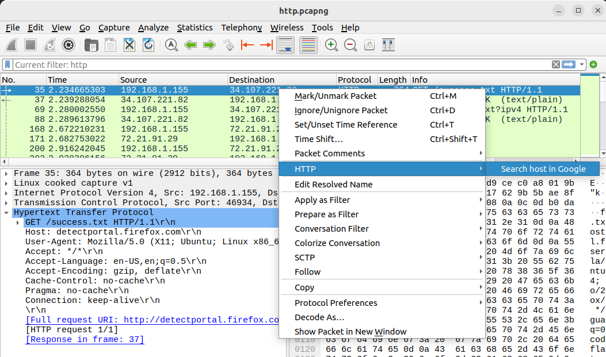
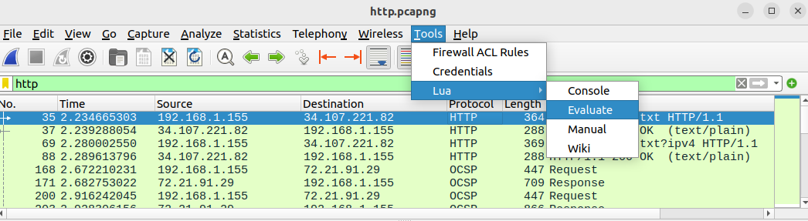
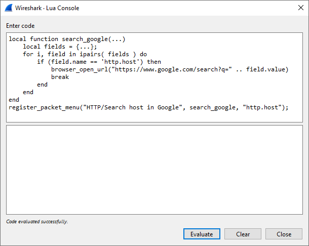
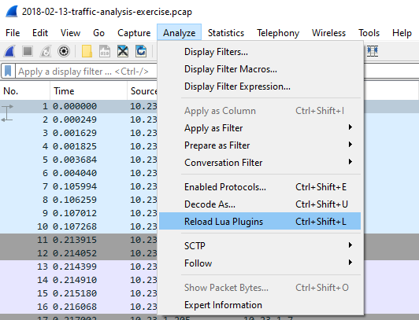

One of the more common challenges in the world of incident response is the multitude of tools in an analyst’s toolbox. Pivoting from one tool to another is often slow, with much copy-pasting between their interfaces. For example, when you’re analyzing a website, you might want to check its reputation on Google Safe Browsing or scan it with SSL Labs. Or when examining traffic to a host, you might want to run ping or traceroute to it.

To make pivoting from Wireshark to other tools easier, I developed a new Wireshark Lua function named ``register_packet_menu()`` to enable adding custom packet context menus and actions based on the packet fields. As such, a user can add a command like “Search Domain in Google” with the packet’s ``http.host`` field. This is extremely similar to ArcSight's Integration Commands.

The ``register_packet_menu()`` function is included in Wireshark 4.2, which is scheduled to be released on November 15, 2023. If you’d like to try it out sooner, you can download one of Wireshark’s nightly builds from https://www.wireshark.org/download/automated/ .

# register_packet_menu() Usage
The ``register_packet_menu()`` function is documented in the [Wireshark Developer's Guide](https://www.wireshark.org/docs/wsdg_html_chunked/lua_module_Gui.html#lua_fn_register_packet_menu_name__action___required_fields__):

")

In practice, ``register_packet_menu()`` could be used as follows:

```lua
local function search_google(...)
    local fields =  {...}
    for i, field in ipairs( fields ) do
        if (field.name == 'http.host') then
            browser_open_url("https://www.google.com/search?q=" .. field.value)
            break
        end
    end
end

register_packet_menu("HTTP/Search host in Google", search_google, "http.host")
```

The above code would add a new packet context menu with a menu of “HTTP” and a submenu of “Search host in Google” for all packets that contain the field “http.host”, as displayed below:



When the menu is clicked, it opens a browser with a Google search and the HTTP Host field's value as the search query:


# Running a Lua script in Wireshark
The quickest way to run an ad-hoc Lua script in Wireshark is from the ``Tools -> Lua -> Evaluate`` menu:



This button opens a text box in which you can paste Lua code and immediately run it:



Another way Wireshark can run a Lua script is by passing it as an argument on the CLI when Wireshark is launched with `-X lua_script:`. For example:

```bash
wireshark -X lua_script:path/to/myscript.lua
```

While both the previous approaches are fine for ad-hoc usage, if you have a script that you’d like to run every time Wireshark launches, you can place the Lua script in the plugin folder. Per the [Wireshark User Guide](https://www.wireshark.org/docs/wsug_html_chunked/ChPluginFolders.html), the plugin folder’s location depends on your operating system:

## On Windows:
* The personal plugin folder is ``%APPDATA%\Wireshark\plugins``.
* The global plugin folder is ``WIRESHARK\plugins``.

## On Unix-like systems:
* The personal plugin folder is ``~/.local/lib/wireshark/plugins``.

If you plan to write your own Wireshark Lua scripts, note that you don't need to reload Wireshark each time you make a change. Instead, you can click on ``Analyze -> Reload Lua Plugins``



# Wireshark Investigators Pack
Together with this feature's release, I’m pleased to announce an accompanying project: the Wireshark Investigators Pack.

The Wireshark Investigators Pack is a collection of custom packet context menus designed for investigating security incidents. It adds context menus for activities like searching for a hostname on Google, pinging an IP address, looking up a hostname, and more. The Wireshark Investigators Pack can be freely downloaded from https://github.com/moshekaplan/wireshark_investigators_pack for installation into your Wireshark plugins folder.

**Here is a full list of the features currently provided in the Wireshark Investigators Pack:**

**DNS**
* Robtex for queried host

**HTTP Host**
* Alienvault OTX
* Google
* nslookup (Windows only)
* ping (Windows only)
* Robtex
* Shodan
* Splunk
* SSL Labs
* VirusTotal
* Whois

**HTTP URL**
* McAfee Categorization
* Unfurl
* URLVoid

**IP**
* ASN lookup
* IPLocation lookup
* IP Void scan
* Shodan search
* Splunk search

**IMF (SMTP)**
* Spamhaus for email sender
* Splunk search for subject

# Shoutouts

Thanks to Peter Wu and Roland Knall for patiently making many suggestions, reviewing the code, and providing much feedback to improve it, and the Wireshark Dev team for their continued support during this feature’s long development.
Links:
* Wireshark Investigator's Pack - https://github.com/moshekaplan/wireshark_investigators_pack
* Merge Request for the Custom Packet context menus - https://gitlab.com/wireshark/wireshark/-/merge_requests/1500
* Wireshark 4.2 Release Schedule - https://wiki.wireshark.org/Development/Roadmap

