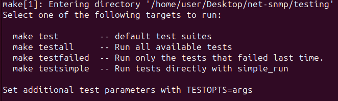
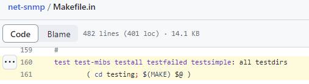
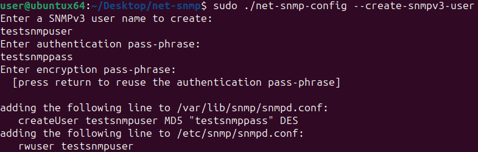
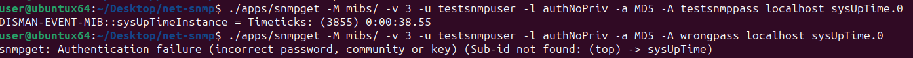
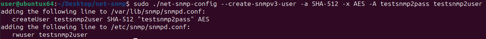
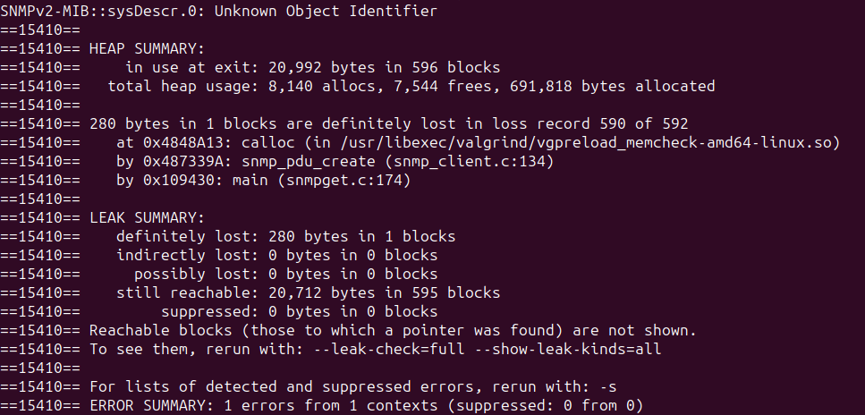

One of our systems was having a problem that the SNMP health monitoring was unreliable.
The vendor blamed it on the SNMP process using too much memory, causing either the system to run out of memory or restart the process.
One of the vendor's articles stated that the system uses Net-SNMP as the SNMP agent.
That led me to a question: Could I find and fix the Net-SNMP bugs that were causing problems for us?

# Background: SNMP and Net-SNMP

SNMP is a protocol for either retrieving or setting values or configurations from a remote system.
One of the most common uses of SNMP is for monitoring the health of a remote system.

Net-SNMP is a free open-source software suite that includes an SNMP "agent"
(in SNMP parlance, an "agent" is the SNMP server that listens for and responds to SNMP requests)
and utilities for interacting with other systems using SNMP.
Two of the more popular utilities are snmpget, used for retrieving a single value from an SNMP agent, and snmpwalk, used for retrieving an entire group of SNMP values.

Before starting this project, I had never heard of Net-SNMP and was surprised to learn that it underpinned the system's SNMP support.
When I shared that knowledge with Shalom Kovacs, his immediate response was "Everything uses net-snmp".
Some quick Googling confirmed this; Many vendors include Net-SNMP in their products including
[Apple](https://apple.stackexchange.com/questions/195315/re-install-stock-net-snmp),
[ASUS](https://cve.mitre.org/cgi-bin/cvename.cgi?name=CVE-2023-26602),
[Barracuda](https://thwack.solarwinds.com/product-forums/network-performance-monitor-npm/f/forum/84724/custom-poller-for-barracuda-spam-firewall-600),
[Broadcom](https://techdocs.broadcom.com/us/en/ca-enterprise-software/layer7-api-management/api-gateway/11-0/administer-the-gateway/gateway-as-snmp-agent/configuring-the-net-snmp-agent.html),
[CheckPoint](https://sc1.checkpoint.com/documents/R81/WebAdminGuides/EN/CP_R81_Gaia_AdminGuide/Topics-GAG/SNMP.htm),
[Cisco](https://www.cisco.com/c/en/us/td/docs/unified_computing/ucs/release/notes/cisco-ucs-manager-rn-4-2.html),
[Citrix](https://support.citrix.com/article/CTX122436/faq-snmp-on-netscaler-appliance),
[Dell](https://www.dell.com/support/kbdoc/en-us/000021179/ecs-how-to-enable-tcp-and-or-udp-on-an-snmp-agent),
[F5](https://techdocs.f5.com/kb/en-us/products/big-ip_apm/manuals/product/apm-config-11-4-0/apm_config_snmp.html),
[Fortinet](https://docs.fortinet.com/document/fortigate/7.4.1/administration-guide/943586/important-snmp-traps),
[HP](https://groups.google.com/g/mailing.unix.net-snmp-coders/c/AKq5YZ0GM-A/m/rnGxalubOCkJ),
[IBM](https://www.ibm.com/support/pages/security-bulletin-vulnerabilities-net-snmp-affect-ibm-security-access-manager-web-cve-2014-3565-cve-2015-5621),
[Juniper](https://supportportal.juniper.net/s/article/How-to-identify-the-NET-SNMP-version-used-in-a-particular-Junos-OS-version?language=en_US),
[McAfee](https://docs.trellix.com/bundle/network-security-platform-10.1.x-product-guide/page/GUID-A1426C92-2E25-4EAD-826A-0D50458AE8A3.html),
[netskope](https://docs.netskope.com/en/netskope-help/data-security/netskope-private-access/publisher-management/manage-a-publisher/),
[Oracle](https://docs.oracle.com/en/servers/management/hardware-management-pack-solaris/11.4/management-agent-guide/configuring-net-snmp-oracle-solaris.html#GUID-6C6AFD37-D91C-47A8-88EF-D2163DFC6823),
[Palo Alto](https://knowledgebase.paloaltonetworks.com/KCSArticleDetail?id=kA10g000000ClsgCAC),
[Qualys](https://www.qualys.com/docs/qualys-software-credits-scanner-appliance.pdf),
[SonicWall](https://psirt.global.sonicwall.com/vuln-detail/SNWLID-2021-0029),
[Sophos](https://docs.sophos.com/nsg/sophos-firewall/18.0/Help/en-us/webhelp/onlinehelp/AdministratorHelp/Logs/LogFileDetails/index.html),
[Ubiquiti](https://community.librenms.org/t/unifi-switch-24-poe-detected-as-linux/13300), and
[Z-Scaler](https://docs.netscaler.com/en-us/citrix-sd-wan/current-release/snmp.html).


# Building Net-SNMP

Net-SNMP compiles with configure and make:

```bash
./configure
make
make install
```

The compiled utilities are then placed in Net-SNMP's apps subdirectory (e.g., `net-snmp/apps/`)
and the application for the snmpd service is in the agent subdirectory (`net-snmp/agent/snmpd`).

# Static Analysis with Coverity, Clang's scan-build, and CodeQL

Since our problem was associated with Net-SNMP using too much memory, my first activity was to see if there were any easy-to-find memory leaks.
Rather than reviewing the code manually, I used Coverity and clang scan-build, which are static analyzers that can examine code for memory leaks and other issues without running it.

Fortunately, Net-SNMP already has a [public Coverity project](https://scan.coverity.com/projects/net-snmp), so I didn't even need to request access - I was able to immediately review the results, leading me to [submitting fixes for 18 detected memory leaks](https://github.com/net-snmp/net-snmp/pulls?q=author%3Amoshekaplan+coverity+leak) and few other small bugs Coverity detected.
I later also ended up [submitting a PR to add a GitHub Action-based CI job to create a new Coverity build daily](https://github.com/net-snmp/net-snmp/pull/724), so that there is always a recent scan available.

Clang's scan-build is like Coverity, albeit less polished and with what appears to be more false positives.
As mentioned, Net-SNMP uses `./configure` and `make`, so running Clang's scan-build is as simple as:

```bash
scan-build ./configure
scan-build make
```

[Clang's scan-build](https://clang-analyzer.llvm.org/scan-build.html) detected many more issues of which two appeared to be both potentially impactful and easy to fix: [another potential memory leak](https://github.com/net-snmp/net-snmp/pull/633) and an [uninitialized variable access](https://github.com/net-snmp/net-snmp/pull/634).

While there are still plenty of issues detected by Coverity and Clang's scan-build, many of the others didn't appear to be security issues or required more experience than I had with the code base to determine how to best fix it.

Another simple static analysis approach I used was to enable extra compiler flags, to see if the C compiler could detect any additional failures (based on [https://nullprogram.com/blog/2023/04/29/](https://nullprogram.com/blog/2023/04/29/) ):

```bash
./configure CFLAGS='-Wall -Wextra -Wno-unused-parameter'
make
```

This led to detecting and fixing [two minor issues](https://github.com/net-snmp/net-snmp/pulls?q=is%3Apr+author%3Amoshekaplan+Use+size_t+), where the result from `strlen` was stored in an `int` instead of a `size_t`.

After I finished playing around with Coverity and scan-build, I decided to also [integrate Net-SNMP with GitHub's CodeQL tool](https://github.com/net-snmp/net-snmp/pull/727), to see if its analyzer would find anything.
CodeQL did have a few findings, but it seemed like most of them were either low impact or false positives, and so I did not submit any patches based on CodeQL's output.

# Using existing test suites and pull requests to find bugs

Another source of potential issues are existing bug reports and pull requests.
Net-SNMP's maintainers were generally responsive, but [one of the pull requests](https://github.com/net-snmp/net-snmp/pull/404) seemed to have so many changes that it was impractical for it to be reviewed and merged.
The solution was obvious: review and resubmit the fixes as smaller pull requests, so they could be merged.

Additionally, in that same pull request, [Bernd Edlinger wrote](https://github.com/net-snmp/net-snmp/pull/404#issuecomment-1067184728):

> PS: to see the sanitizer errors it is best to do `ASAN_OPTIONS=log_path=$PWD/asan.log make test`

His advice was solid; why bother creating my own tests when there's an entire existing test suite that may have not been run with sanitizers?



So first, create an ASAN build:

```bash
./configure CFLAGS='-g -fsanitize=address,undefined,leak' --with-mib-modules=examples/example
make
```

Then run the test suite:

```bash
export ASAN_OPTIONS="detect_leaks=1:log_path=$PWD/asan.log:log_exe_name=1"
make testall
```

Note that for reruns, you might want to use `make testfailed` instead.

Although the tests passed normally, with ASAN enabled, quite a few failed when memory leak detection was enabled.
The next step was to figure out how to determine exactly which test was failing.
Looking at Net-SNMP's `Makefile.in`, you can see that the different test options simply call into the testing directory's Makefile:



And that the testing directory's Makefile is calling the `RUNFULLTESTS` PERL script. So, for targeted testing (and fixes), we can execute the `RUNFULLTESTS` script ourselves.

For example, to run all the tests in the "unit-tests" directory:

```bash
./RUNFULLTESTS -g "unit-tests"
```

And to run a particular unit test:
```bash
./RUNFULLTESTS -g "unit-tests" -r "011"
```

And if you want to be lazy and search all the directories:

```bash
./RUNFULLTESTS -g "all" -r "011"
```

For my purposes, I wanted that all tests should pass with LeakSanitizer enabled. So I ran:

```bash
./RUNFULLTESTS -g "all"
```
This led to reporting and fixing a few memory leaks in the test code ([1](https://github.com/net-snmp/net-snmp/pull/720), [2](https://github.com/net-snmp/net-snmp/pull/721), [3](https://github.com/net-snmp/net-snmp/issues/722), [4](https://github.com/net-snmp/net-snmp/issues/723)).

More information on Net-SNMP's testing is available here: [https://net-snmp.sourceforge.io/wiki/index.php/Testing](https://net-snmp.sourceforge.io/wiki/index.php/Testing)

# Setting up a local snmpd instance

My next approach to look for memory leaks was to run Net-SNMP's utilities and see if any leaks were detected.
To fully exercise the utilities, I'd need to run my own local instance of snmpd.
Setting up a local instance of snmpd on my Ubuntu 23.04 system was as easy as running:

```bash
sudo apt install snmpd
```

That installed the SNMP agent and configured it to listen on the localhost interface. I could then run my locally compiled Net-SNMP utilities against it. From my net-snmp folder:

```bash
./apps/snmpget -M mibs/ -v2c -c public 127.0.0.1 SNMPv2-MIB::sysDescr.0
./apps/snmpwalk -M mibs/ -v2c -c public 127.0.0.1
```

Those worked for SNMP v2 unauthenticated access!

Now let's create a user. Net-SNMP users are loaded when the snmpd daemon launches, so the service needs to be restarted before the configuration file changes take effect.

```bash
sudo service snmpd stop
sudo ./net-snmp-config --create-snmpv3-user
```

(Note: Under the hood, `net-snmp-config` just runs `net-snmp-create-v3-user`. If you don't have the snmpd package installed, you'd need to run `net-snmp-create-v3-user` directly)



This added the user "testsnmpuser" to `/etc/snmp/snmpd.conf` and the credentials to `/var/lib/snmp/snmpd.conf`

I then restarted snmpd so it would load the new user:

```bash
sudo service snmpd start
```

and then tested it out, with both the correct and incorrect passwords:

```bash
/apps/snmpget -M mibs/ -v 3 -u testsnmpuser -l authNoPriv -a MD5 -A testsnmppass localhost sysUpTime.0
/apps/snmpget -M mibs/ -v 3 -u testsnmpuser -l authNoPriv -a MD5 -A wrongpass localhost sysUpTime.0
```




As an aside, the testsnmpuser account was created with DES and MD5, which are both insecure. If we want to something more secure than MD5 and DES, we can use `-a` and `-x` to specify different algorithms. We can also supply the password with `-A`, making it possible to create an SNMP user in a shell script:

```bash
sudo ./net-snmp-config --create-snmpv3-user -a SHA-512 -x AES -A testsnmp2pass testsnmp2user
```



The benefit of using authenticated SNMPv3 access is that the user has much more data available when we run snmpwalk:

```bash
./apps/snmpwalk -M mibs/ -v 3 -u testsnmpuser -l authNoPriv -a MD5 -A testsnmppass 127.0.0.1
```

# Dynamic Analysis with Valgrind

Now that I have a running SNMP daemon that I can successfully interact with, I can test the Net-SNMP utilities against it.
The first tool I used was Valgrind, which hooks every memory allocation and detect issues like memory leaks, use after frees, and accessing uninitialized memory values.

Running Valgrind against compiled binaries is generally straightforward. Normally, one would run `valgrind myexecutable`.

However, because the compiled Net-SNMP files in `apps/` are actually shell scripts, running Valgrind on `./apps/snmpget` would actually enable all the memory detections on the shell process (e.g., Bash), which would muddy our analysis. To avoid running Valgrind on the shell script, we need to use `libtool` to limit Valgrind's analysis to snmpget:

```bash
libtool --mode=execute valgrind ./apps/snmpget -M mibs/ -v2c -c public 127.0.0.1 SNMPv2-MIB::sysDescr.0
```

A common issue I had noticed was that Net-SNMP applications didn't have great error handling.
SNMP applications use MIB (Management Information Base) files to document which OIDs are available and map them to human-readable names.
So what if I forget to include the MIBs?

```bash
libtool --mode=execute valgrind ./apps/snmpget -v2c -c public 127.0.0.1 SNMPv2-MIB::sysDescr.0
```



As you can see, if the MIBs fail to load, snmpget leaks memory.
Upon further digging, this leak happens because snmpget allocates a PDU for sending the SNMP request and if it's able to parse the MIBs, it calls `snmp_synch_response()`, which frees the sending PDU.
But if snmpget fails to parse the MIBs, it skips straight to the end and never frees the PDU.
The fix is simple: [If parsing fails, free the PDU right then and there to avoid leaking it](https://github.com/net-snmp/net-snmp/pull/683).
While this sort of memory leak is not actually a vulnerability, because attackers cannot trigger it, fixing it makes it easier to detect other, more potentially impactful leaks.

# Fuzzing CLI arguments

While I was using Net-SNMP's snmptranslate, I accidentally [triggered a NULL pointer dereference and segmentation fault](https://github.com/net-snmp/net-snmp/issues/679), which made me think: Maybe other combinations of command-line arguments would trigger bugs?

Rather than testing each possible argument directly, I decided to fuzz Net-SNMP's CLI utilities.
To fuzz Net-SNMP's command-line utility's arguments, I first downloaded and compiled [AFL++](https://github.com/AFLplusplus/AFLplusplus/) :

```bash
make
cd utils/argv_fuzzing
make
```

Then built Net-SNMP, this time using afl-clang with a few sanitizers to detect memory leaks and improper memory accesses:

```bash
CC=afl-clang CFLAGS='-g -fsanitize=address,undefined,leak' ./configure
make
```

I then fuzzed my compiled Net-SNMP utilities command-line arguments:

```bash
AFL_NO_FORKSRV=1 AFL_NO_AFFINITY=1 AFL_PRELOAD="/home/user/Desktop/AFLplusplus/utils/argv_fuzzing/argvfuzz64.so" libtool --mode=execute afl-fuzz -m none -i fuzz_in -o fuzz_snmpget_out -- ./apps/snmpget
```

Afl-fuzz generated so many crashes that I wrote a short Python script to aid reviewing the crashes:

```python
import os
import os.path
import subprocess

cmd = "/home/user/Desktop/net-snmp/apps/snmpget"
crash_dir = "/home/user/Desktop/net-snmp/fuzz_snmpget_out/default/crashes"

errors = 0
for fname in sorted(os.listdir(crash_dir)):
    try:
        with open(os.path.join(crash_dir, fname), 'rb') as fh:
            data = fh.read()
            data = data.replace(b"\x00",b" ")
            args = data.split()
    except Exception as e:
        print(f"failed to open: {fname}", e)
        raise

    try:
        result = subprocess.run([cmd] + args, capture_output=True,timeout=5)
        # -11 is SIGSEGV
        if b'Sanitizer' in result.stderr or b'Sanitizer' in result.stdout or result.returncode not in [0,1]:
            print(fname, result.returncode)
            print(str(([cmd] + args)).replace("', b'", "' '"))
            try:
                print(result.stdout.decode('utf-8'))
            except:
                print(result.stdout)

            try:
                print(result.stderr.decode('utf-8'))
            except:
                print(result.stderr)
            print("*" * 80)
            errors += 1
    except:
        print("Timeout!")
        print(str(([cmd] + args)).replace("', b'", "' '"))
        print("*" * 80)
print("Total number of errors:", errors)
```

One gotcha that had me stuck for a while was how to handle the NULL bytes in the AFL-Fuzz inputs.
Initially, I mistakenly removed the NULL bytes to avoid triggering errors with Python's `subprocess.run`.
However, I later realized that Linux normally uses NULL bytes as argument separators, so if I wanted to mimic that, I'd be best served by replacing the NULL bytes with spaces.
Once I made that correction, I struck gold! Besides the memory leaks, there were also segmentation faults, use after frees, double frees, and out-of-bound heap reads.
After removing duplicates, fuzzing discovered [ten unique issues](https://github.com/search?q=repo%3Anet-snmp%2Fnet-snmp+author%3Amoshekaplan+fuzzing+the+command-line+arguments&type=issues)
and I was able to submit [three pull requests](https://github.com/search?q=repo%3Anet-snmp%2Fnet-snmp+author%3Amoshekaplan+fuzzing+the+command-line+arguments&type=pullrequests) to Net-SNMP.

# More Net-SNMP Fuzzing

Initially, I had thought that I might fuzz the Net-SNMP agent code. This would be the most security-relevant code, as it is exposed to remote users.
However, I decided it would not be an efficient use of time because [Net-SNMP is already integrated into OSS-Fuzz](https://github.com/google/oss-fuzz/tree/master/projects/net-snmp) and unless I had a novel dataset, wrote a new fuzzing harness, or wrote a new fuzzer, attempting to compete with OSS-Fuzz's cluster is pointless.

However, I did happen to encounter a [runtime error caused by an invalid configuration file entry](https://github.com/net-snmp/net-snmp/issues/730), which made me wonder: Perhaps Net-SNMP's configuration parsing is not included in OSS-Fuzz and there are more bugs in the configuration parsing?

Fortunately, afl-fuzz (and AFL++, as used here), make fuzzing a file parser a cinch:

```bash
./configure CC=afl-clang CFLAGS='-g -fsanitize=address,undefined,leak -Wall -Wextra -Wno-unused-parameter ' --with-mib-modules=examples/example
make

AFL_NO_FORKSRV=1 AFL_NO_AFFINITY=1 libtool --mode=execute afl-fuzz -d -i fuzz_in -o fuzz_out -t 10000 ./agent/snmpd -fd -M /home/user/Desktop/net-snmp/mibs/ -C -r -c @@
```

The vanilla fuzzer was terribly slow at about 5 execs/second, but even then, found three ([1](https://github.com/net-snmp/net-snmp/issues/732), [2](https://github.com/net-snmp/net-snmp/issues/733) , [3](https://github.com/net-snmp/net-snmp/issues/734)) memory safety issues in just over an hour.

# Fixing typos

While I was reading through Net-SNMP's documentation, I noticed and [submitted fixes for several typos](https://github.com/net-snmp/net-snmp/pulls?q=is%3Apr+author%3Amoshekaplan+typo+OR+grammar+created%3A%3C2023-09-11).
However, I realized that it would be possible to take a more thorough approach by running the entire project through Aspell and fixing as many typos as possible.

```bash
find . -type f -name "\*.c" -exec aspell --mode=ccpp --home-dir=. --personal=net-snmp-dict.txt check {} \;
```

While I'm sure my quick and dirty spellcheck missed plenty of issues, it still enabled me to [submit fixes for more than seven hundred easily-fixed typos](https://github.com/net-snmp/net-snmp/pulls?q=is%3Apr+author%3Amoshekaplan++spelling).

Now let's get back to technical work.

# Custom SNMP modules

Out of the box, Net-SNMP supports providing system information like hard drive, CPU, and memory utilization.
However, vendors often want to expose additional data via SNMP.
To support exposing additional data, Net-SNMP supports loading in custom MIBs and dynamically loading custom modules.
To have Net-SNMP's snmpd load a custom module, modify snmpd.conf (`/etc/snmp/snmpd.conf`) to include a line with:

```
dlmod modulename /path/to/module.so
```

This will cause snmpd to load `module.so` at launch and execute `init_modulename` at launch.
I was able to extract `snmpd.conf` from my system with the Net-SNMP memory leaks and guess what? It includes entries to load a custom module!
My hunch is that a memory leak is much more likely to be in a vendor's code than in Net-SNMP, so I extracted the relevant module.so and tossed it in [Ghidra](https://ghidra-sre.org/).

`module.so` is surprisingly readable in Ghidra.
The starting points are each of the `init_modulename` functions which are Net-SNMP's entry points.
There are not many of these, but they're mostly used for calling the imported [netsnmp_create_handler_registration](http://www.net-snmp.org/dev/agent/group__handler.html#ga537fac61fff7e112e121e5f629eded65) function, which registers a handler used for responding to SNMP requests.
Unfortunately, there are well over a hundred handlers registered, which makes auditing all of them for memory leaks (or other vulnerabilities) an arduous process and something I simply would not have time to do.

For more info on Net-SNMP's external modules, see:
* [https://net-snmp.sourceforge.io/tutorial/tutorial-5/toolkit/mib_module/index.html](https://net-snmp.sourceforge.io/tutorial/tutorial-5/toolkit/mib_module/index.html)
* [https://net-snmp.sourceforge.io/tutorial/tutorial-5/toolkit/dlmod/index.html](https://net-snmp.sourceforge.io/tutorial/tutorial-5/toolkit/dlmod/index.html)
* [https://linux.die.net/man/5/snmpd.conf](https://linux.die.net/man/5/snmpd.conf)

# Trying to remotely trigger memory leaks

Instead of trying to audit more than a hundred SNMP handlers, I decided to take a different approach of trying to remotely trigger a memory leak.

The theory is straightforward: A memory leak occurs when a process allocates memory, but does not free it after it completes the operation.
Therefore, to detect which SNMP handler has a memory leak, all we'd need to do is examine snmpd's memory utilization, make an SNMP GET to a particular SNMP handler (based on the OID), and then examine snmpd's memory utilization again.
If we see an increase in allocated memory, we have an SNMP handler with a potential memory leak.

With an approach planned, I wrote a script to test every single one of the 7000+ supported OIDs. However, there were 365 times that the memory usage changed - and sometimes even decreased. I learned that Net-SNMP caches values and so some fluctuations were tied to the cache storage and clearing.

Shortly after my initial test I had taken some vacation and when I returned, there was a significant change of circumstance.
While I was out, the vendor had released an update that supposedly included fixes for snmpd's known memory leaks and it had been installed on one of our two systems.
So I had a perfect setup for A/B testing: I could run my script to check for memory leaks against both systems and see how memory consumption differed between the two versions.
I was pleasantly surprised to see that in contrast to the old release having 365 OIDs with differences in memory utilization, the new release had only 17. So although it was far from being a precise measurement, an order of magnitude difference does indicate improvement.

I then re-executed my testing script with those 17 OIDs to see if I could replicate any of those memory leaks, but was unable to do so. As I was unable to  replicate any of the custom handler leaks, I abandoned my testing against the custom SNMP modules.

# Integrating Additional Tooling

To try to improve Net-SNMP over the long-term, I ultimately submitted PRs and issues to have a few scanners integrated in:

* CodeQL - [https://github.com/net-snmp/net-snmp/pull/727](https://github.com/net-snmp/net-snmp/pull/727)
* Coverity - [https://github.com/net-snmp/net-snmp/pull/724](https://github.com/net-snmp/net-snmp/pull/724)
* OSSF Scorecard - [https://github.com/net-snmp/net-snmp/pull/739](https://github.com/net-snmp/net-snmp/pull/739)
* SonarCloud - [https://github.com/net-snmp/net-snmp/issues/738](https://github.com/net-snmp/net-snmp/issues/738)


# Future Work
Even though I worked for about three months on-and-off working to improve Net-SNMP, I still feel like I only scratched the surface.
There's still plenty to do, like:

* Tracing attack surface for malicious devices monitored by SNMP, trap senders, or subagents
* Reviewing [legacy vulnerabilities](https://cve.mitre.org/cgi-bin/cvekey.cgi?keyword=net-snmp) for additional attack vectors
* Reviewing dependencies for vulnerabilities. Dependencies can be listed with `apt-rdepends snmpd`
* Adding CI jobs for more checkers, like `cppcheck`, `clang-tidy`, and code coverage
* Writing more fuzzers, like for the command-line parers or configuration parsers
* Auditing or fuzzing module-specific code for vulnerabilities, like `hr_proc`, `hr_network`, `ifTable`, `ifXTable`, `ipAddressTable`, and `hrh_storage`
* Creating a CI job to publish manpages and doxygen documentation
* Writing or improving API documentation for all functions
* Generating an SBOM


# Final Thoughts

While I ultimately did not end up finding and submitting a fix for a memory leak that was impacting our systems
and it's possible the vendor had even beaten me to it,
my efforts to improve Net-SNMP went far beyond what I had initially envisioned and
I think this effort was beneficial for Net-SNMP, myself, and the many products that use Net-SNMP as an SNMP agent.

I'd also like to think there were a few reasons why these efforts seemed to be particularly well-received by the Net-SNMP maintainers that I plan to replicate in future efforts:

* Send pull requests, not just bug reports. Although bug reports are useful, maintainers are busy and submitting a pull request lets them go straight to a fix.
* Make fixes easy to merge by providing a clear explanation of the problem being solved and keeping the changeset small enough that it can be easily reviewed. If the PR is too large to easily review, it may not be merged.
* Be a good guest: As someone less familiar with the project, it's easy to accidentally violate a convention or even introduce a bug. If you do, apologize, and fix it. And realize that if you suggest something and the maintainers reject the change, do not take it personally - they may have a history with that suggestion that you're unaware of.

Thanks to Shalom Kovacs for kindly answering my many SNMP-related questions and Bart Van Assche for suggesting improvements and merging my many pull requests.

